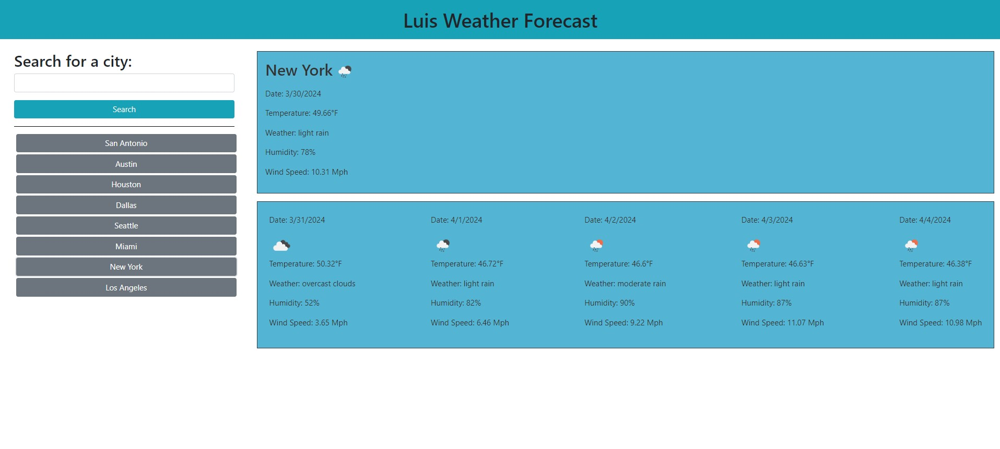

# Luis's Weather Forecast Dashboard (Module 06 Server-Side APIs Challenge ) 

## This Challenge contains my weather dashboard website to include the following functions:
- Allows website visitors to enter a city name and search weather conditions.
- Once the user hits enter it will show the cities forecast for that day and then the next 5 days forecast below.
- The information populated is also saved locally to the local storage and will display previous cities searched for the ease of clicking and accessing immediately.

## Installation
- To access my weather dashboard website follow link: https://ricanlonghorn23.github.io/Luis-Weather-Dashboard/
- To Access my weather dashboard website repository: https://github.com/ricanlonghorn23/Luis-Weather-Dashboard.git

## Usage
The user will need to enter the URL https://ricanlonghorn23.github.io/Luis-Weather-Dashboard/. When they enter the website, they will be on the landing page of my weather dashboard website. The user will be given a chance to type in the name of the city where they would like to see the current and future weather conditions. Once they have typed the name of the city and clicked the search button they will be presented with the current weather conditions with the following information: City name, Icon representation of the current weather condition, date, Temperature, weather conditions text, humidity, and wind speed. Additionally, below today's forecast, it will also display the next 5-day forecast for that searched city with the following information: date, Icon representation of the current weather condition, Temperature, weather conditions text, humidity, and wind speed. When the user does this the city is also added to the search history and it shows on the left side of the screen below the search bar. When the user clicks on a city in the displayed search history they are again presented with the current and future forecasts for that city.

 

## Credits
Luis Aldaz

